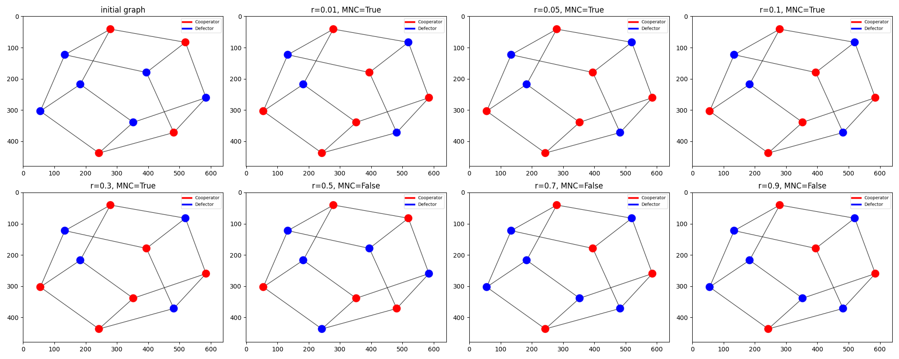

# 多人雪堆博弈求解网络节点最小覆盖

## 问题描述

节点的初始状态可随机定为 Cooperator 或者 Defector ,按照某种给定顺序（例如１,2,…,10）依次检查每个节点，是否改变其状态可以获得更大收益，如果是则改变状态，否则不改变，直到所有节点都不再改变状态为止。验证合作的节点集合是否是极小节点覆盖 (minimum node cover, MNC) 。

## 系统环境

```shell
windows10
python3.11
```

## 算法流程

 1. 初始化一个10节点的无向图，每个节点的合作状态随机分配为合作（cooperator）或者背叛（defector）
 2. 设置6个不同的r值 $(0.01, 0.05, 0.1, 0.3, 0.5)$ ，用于验证当雪堆博弈满足 $r<1/k_{max}$ 时，合作节点集合是否是极小节点覆盖
 3. 设置一个最大迭代次数 100 ，当迭代次数超过最大迭代次数，或者无向图中各个节点状态不再改变时，停止迭代
 4. 依次检查每个节点，是否改变其状态可以获得更大收益，如果是则改变状态，否则不改变，直到所有节点都不再改变状态为止
 5. 绘制出经过迭代后的无向图，判断合作集节点是否为极小节点覆盖

## 结果展示



由图可知，当r值小于 $1/k_{max}$ 时，合作节点集合是极小节点覆盖。而当r值大于 $1/k_{max}$ 时，合作节点集合不一定是极小节点覆盖。
